# Base de datos TPV — ERD lógico

| Campo | Valor |
|---|---|
| Fase | 01 · Base de datos |
| Fecha | 2026-09-11 |
| Motor | PostgreSQL 16 |
| Fuente de verdad DDL | `docs/database/schema.sql` (los modelos SQLAlchemy lo replican) |
| Migración inicial | `backend/alembic/versions/0001_initial_schema.py` |
| Migración catálogo | `backend/alembic/versions/0002_catalog_pricing.py` (fase 04: tarifas, códigos, imágenes) |
| Seeds | `docs/database/seed.sql` |
| Tests de integridad | `backend/tests/test_integrity.py` |

## Convenciones globales

- **PK:** `uuid` con `gen_random_uuid()` en todas las entidades de negocio; `bigserial` solo en
  logs que necesitan cursor monotónico (`audit_log`, `event_log`); PK compuesta en tablas de
  unión (`role_permissions`).
- **Dinero:** `numeric(12,2)`; cantidades `numeric(10,3)` (pesables); tipos impositivos
  `numeric(5,2)`. Prohibido `float`.
- **Tiempos:** `timestamptz` (UTC en BD). `business_date date` solo para jornada de caja.
- **UUID** en API/referencias externas; enteros internos solo donde el orden es el contrato
  (cursores de replay).
- **Soft delete** (`active boolean`) en catálogos y personal; **nunca** en registros económicos
  (ventas, pagos, tickets, facturas, caja), que usan estados (`status`, `voided_at`).
- **Snapshots históricos:** las líneas de venta copian nombre, precio e IVA al vender; el ticket
  y la factura congelan su render en `payload jsonb`; `tax_rates` tiene vigencia temporal;
  `product_prices` guarda histórico de precios.
- **`updated_at`** por trigger `set_updated_at()` en tablas mutables.

## Diagrama por dominios (Mermaid)

```mermaid
erDiagram
    %% ===== Seguridad y personal =====
    roles ||--o{ users : "rol"
    roles ||--o{ role_permissions : ""
    permissions ||--o{ role_permissions : ""
    users ||--o{ user_sessions : "refresh tokens"
    users ||--o{ cash_sessions : "abre/cierra"
    users ||--o{ orders : "crea"

    %% ===== Terminales y dispositivos =====
    terminals ||--o{ devices : ""
    terminals ||--o{ cash_sessions : ""
    terminals ||--o{ orders : ""
    terminals ||--o{ tickets : "serie"
    terminals ||--o{ document_sequences : ""
    devices ||--o{ printers : "conexión agent"
    devices ||--o{ payments : "pinpad"

    %% ===== Catálogo =====
    departments ||--o{ categories : ""
    categories ||--o{ products : ""
    tax_rates ||--o{ products : "IVA por defecto"
    products ||--o{ product_prices : "histórico"
    products ||--o{ product_barcodes : ""
    products ||--o{ product_images : ""
    price_tiers ||--o{ product_tier_prices : ""
    products ||--o{ product_tier_prices : ""
    products ||--o{ panel_items : ""
    panels ||--o{ subpanels : ""
    panels ||--o{ panel_items : ""
    subpanels ||--o{ panel_items : ""

    %% ===== Ventas =====
    customers ||--o{ orders : "opcional"
    dining_tables ||--o{ orders : "mesa (draft)"
    cash_sessions ||--o{ orders : ""
    orders ||--o{ order_lines : "snapshot"
    products ||--o{ order_lines : ""
    orders ||--o{ payments : ""
    payment_methods ||--o{ payments : ""
    orders ||--o| tickets : "1:1"
    orders ||--o{ invoice_lines : ""
    invoices ||--o{ invoice_lines : ""
    customers ||--o{ invoices : ""
    orders ||--o{ refunds : "original"
    orders ||--o| refunds : "devolución (negativa)"
    orders ||--o{ sale_events : "para fiscal futuro"

    %% ===== Caja =====
    cash_sessions ||--o{ cash_movements : ""
    cash_sessions ||--o{ cash_counts : "arqueos"
    cash_counts ||--o{ cash_count_lines : "denominaciones"
    payments ||--o{ cash_movements : "opcional"

    %% ===== Restaurante / KDS =====
    zones ||--o{ dining_tables : ""
    orders ||--o| kitchen_orders : "comanda"
    kitchen_orders ||--o{ kitchen_order_lines : ""
    order_lines ||--o{ kitchen_order_lines : ""

    %% ===== Impresión =====
    printers ||--o{ print_jobs : ""

    %% ===== Sistema =====
    parameters {
        text key PK
        jsonb value
    }
```

## Entidades por dominio

### Seguridad y personal

| Tabla | Descripción | Claves/Notas |
|---|---|---|
| `roles` | Roles RBAC (`admin`, `manager`, `waiter`) | `code` único; `is_system` impide borrar roles base |
| `permissions` | Permisos granulares (`sales.charge`, `orders.void`, `cash.close`…) | `code` único |
| `role_permissions` | Unión N:M | PK compuesta |
| `users` | Personal: credencial + `pin_hash` para terminal | `username` único; soft delete `active`; `role_id` RESTRICT |
| `user_sessions` | Refresh tokens rotativos | `token_hash` único; `expires_at`; revocación |

### Terminales y dispositivos

| Tabla | Descripción | Claves/Notas |
|---|---|---|
| `terminals` | TPVs registrados | `code` único (`TPV-1`); origen de series de ticket |
| `devices` | Dispositivos físicos registrados (agente, pinpad, impresora, cajón, visor) | `kind` enum; `token_hash` para autenticación de agente; `last_seen_at` |

### Catálogo (Productos)

| Tabla | Descripción | Claves/Notas |
|---|---|---|
| `departments` | Departamentos (nivel contable/estadístico) | `code` único |
| `categories` | Categorías de venta | FK `department_id` opcional |
| `tax_rates` | Tipos de IVA con **vigencia temporal** (`valid_from`/`valid_to`) | Permite históricos correctos |
| `products` | Productos | `price` actual denormalizado; snapshot en líneas; `sku` único nullable |
| `product_prices` | **Histórico inmutable** de precios | Índice parcial: un precio vigente por producto |
| `price_tiers` | Tarifas de precio (empleado, mayorista…) | `code` único; soft delete |
| `product_tier_prices` | Override de precio por tarifa | PK compuesta `(product_id, tier_id)`; no toca el histórico base |
| `product_barcodes` | Códigos de barras del producto | `barcode` **único global** |
| `product_images` | Rutas de imágenes ordenadas | Sin binarios en BD; índice por producto |
| `panels` / `subpanels` | Rejillas del TPV visual | `subpanels.panel_id` RESTRICT |
| `panel_items` | Botones de rejilla | CHECK: pertenece a panel **o** subpanel; posición `row/col` |

### Clientes

| Tabla | Descripción | Claves/Notas |
|---|---|---|
| `customers` | Clientes con datos fiscales para facturas | `tax_id` único nullable; `discount_pct` con CHECK |

### Ventas

| Tabla | Descripción | Claves/Notas |
|---|---|---|
| `orders` | La venta (estado: `draft → paid`, o `voided`) | Snapshots de sesión/terminal/usuario; totales al cobro; CHECK: `paid` exige `cash_session_id` y `paid_at` |
| `order_lines` | Líneas con **snapshot** (nombre, precio, IVA) | FK `orders` CASCADE (solo se borran con draft); `quantity <> 0` (negativo en devoluciones); descuento 0–100 |
| `payments` | Cobros de una venta | `amount > 0`; `status`; `device_id` para pinpad; `external_ref` |
| `payment_methods` | Formas de pago configurables | `kind` enum (`cash` afecta a caja); `opens_drawer` |
| `tickets` | Documento impreso (1:1 con `orders`) | `UNIQUE (terminal_id, series, number)`; `payload` congelado para reimpresión |
| `invoices` | Facturas | `UNIQUE (series, year, number)`; estado `issued/voided`; `payload` |
| `invoice_lines` | Tickets agrupados en factura | `order_id` único (una venta solo en una factura) |
| `refunds` | Enlace devolución ↔ venta original | `refund_order_id` único; motivo obligatorio |
| `document_sequences` | Series de numeración (tickets por terminal, facturas por año) | Asignación con `SELECT … FOR UPDATE` (concurrencia) |
| `sale_events` | **Eventos genéricos de venta** para el futuro adaptador fiscal | `dispatched_at NULL` = cola pendiente; sin nada fiscal en el core |

### Caja

| Tabla | Descripción | Claves/Notas |
|---|---|---|
| `cash_sessions` | Sesiones de caja | **Índice parcial único: una sesión abierta por terminal**; cierre exige recuento |
| `cash_movements` | Entradas/salidas con motivo | `amount > 0`; enlace opcional a `payments` |
| `cash_counts` + `cash_count_lines` | Arqueos por denominación | Un arqueo puede hacerse varias veces por sesión |

### Restaurante / KDS

| Tabla | Descripción | Claves/Notas |
|---|---|---|
| `zones` / `dining_tables` | Zonas y mesas | **Índice parcial único en `orders (dining_table_id) WHERE status='draft'`**: un draft abierto por mesa |
| `kitchen_orders` | Comanda (1:1 con venta) | Estado KDS en cabecera |
| `kitchen_order_lines` | Líneas enviadas a cocina | FK a `order_lines`; estado por línea |

### Impresión

| Tabla | Descripción | Claves/Notas |
|---|---|---|
| `printers` | Impresoras | CHECK por conexión: `network`+`address` **xor** `agent`+`device_id`; un default por tipo (índice parcial) |
| `print_jobs` | Cola de trabajos | `dedupe_key` único (idempotencia ante replay WS); `attempts`, `last_error` |

### Sistema

| Tabla | Descripción | Claves/Notas |
|---|---|---|
| `audit_log` | **Auditoría append-only** (PK `bigserial`) | Sin UPDATE/DELETE (grants revocados al instalar); índices por entidad/usuario/fecha |
| `event_log` | Bus de eventos WebSocket | PK `bigserial` = cursor de replay; `event_id` uuid único; índice `(topic, id)` |
| `parameters` | Configuración global | PK `key`; valor `jsonb` |
| `idempotency_keys` | Deduplicación de operaciones de dinero | PK `key`; `expires_at` para purga |

## Índices clave (además de PK/UNIQUE)

| Índice | Motivo |
|---|---|
| `orders (status, created_at)` | Informes y supervisión de drafts |
| `orders (cash_session_id)` | Totales de sesión (X/Z) |
| `orders (dining_table_id) WHERE status='draft'` | Ocupación de mesa + unicidad |
| `orders (terminal_id, created_at)` | Cierre de día por terminal |
| `order_lines (order_id)`, `(product_id)` | Joins habituales |
| `payments (order_id)`, `(payment_method_id, created_at)` | Cobros e informes por forma de pago |
| `cash_movements (cash_session_id)` | Listado de movimientos |
| `print_jobs (printer_id, status) WHERE status IN ('queued','sent')` | Cola activa de impresión |
| `event_log (topic, id)` | Replay de WebSocket |
| `sale_events (created_at) WHERE dispatched_at IS NULL` | Cola para adaptador fiscal futuro |
| `audit_log (entity, entity_id)`, `(user_id, occurred_at)` | Consulta de auditoría |
| `product_prices: UNIQUE (product_id) WHERE valid_to IS NULL` | Un precio vigente |
| `product_images (product_id)` | Detalle del producto sin escaneo completo |
| `cash_sessions: UNIQUE (terminal_id) WHERE closed_at IS NULL` | Una caja abierta por terminal |

## Estrategia de concurrencia

1. **Numeración** (`document_sequences`): `SELECT … FOR UPDATE` por fila de serie → números
   correlativos sin colisiones con decenas de terminales; bloqueo de milisegundos.
2. **Sesión de caja / mesa:** unicidad garantizada por índices parciales (no por lógica de app).
3. **Cobros:** idempotencia por `idempotency_keys.key` (insert-first, `ON CONFLICT` → lectura del
   resultado previo).
4. **Aislamiento:** `READ COMMITTED` por defecto; las escrituras económicas son transacciones
   cortas y atómicas (venta+cobro+ticket en un COMMIT).
5. **Colas** (`print_jobs`, `sale_events`, `event_log`): claims por `FOR UPDATE SKIP LOCKED`
   cuando haya más de un worker.

## Integridad referencial

- Todas las FK con nombre explícito (`fk_<tabla>_<col>_<ref>`); `ON DELETE RESTRICT` como norma
  (nada económico se borra); `CASCADE` solo en hijos propiedad de un draft (`order_lines`,
  `cash_count_lines`, `kitchen_order_lines`, `invoice_lines`, `user_sessions`).
- Catálogos con soft delete: las FK históricas siguen resolviendo (nunca se borra la fila).
- `tax_rates` vigencia temporal: las líneas guardan copia del tipo (`tax_rate_snapshot`), por lo
  que cerrar la vigencia no afecta a históricos.
